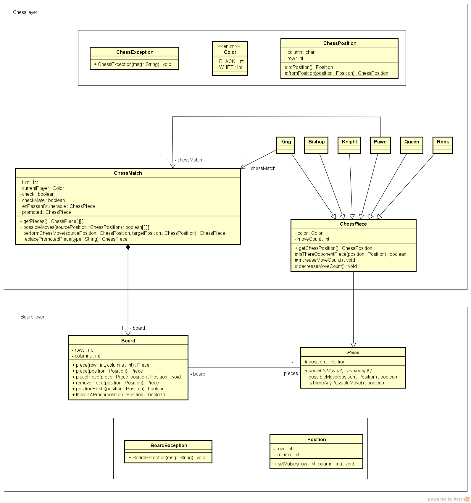

## ♟️ Jogo de Xadrez em Java
# 1. Nome do Projeto

Jogo de Xadrez em Java

# 2. Descrição do Projeto
O projeto consiste no desenvolvimento de um jogo de xadrez para dois jogadores, executado através do terminal.
A aplicação representa o tabuleiro, as peças e seus respectivos comportamentos, além de controlar os turnos, validar movimentações e gerenciar as peças capturadas.
O projeto foi desenvolvido com foco na aplicação prática de conceitos de Programação Orientada a Objetos em Java, utilizando uma modelagem baseada nas entidades e regras presentes no domínio do xadrez.

# 3. Justificativa
O xadrez foi escolhido como domínio do projeto por possuir diferentes tipos de peças, regras específicas de movimentação e diversas relações entre os elementos da partida.
Essa característica permite aplicar, em um problema prático, conceitos importantes de desenvolvimento de software, como encapsulamento, herança, abstração, polimorfismo, composição, coleções, tratamento de exceções, expressões lambda e Streams.
Além da implementação da lógica do jogo, o projeto tem como objetivo desenvolver a capacidade de transformar regras de negócio em código organizado e estruturado.

# 4. Objetivos
* 4.1 Objetivo Geral 
Desenvolver um jogo de xadrez em Java, executado através do terminal, aplicando conceitos de Programação Orientada a Objetos e técnicas de desenvolvimento de software.

* 4.2 Objetivos Específicos
Modelar as principais entidades do domínio do xadrez;
Representar o tabuleiro e suas posições;
Implementar os diferentes tipos de peças;
Implementar os movimentos específicos de cada peça;
Validar as jogadas realizadas pelos jogadores;
Controlar os turnos da partida;
Implementar a captura de peças;
Gerenciar as peças presentes no tabuleiro;
Gerenciar as peças capturadas;
Utilizar coleções para armazenamento e manipulação de objetos;
Utilizar expressões Lambda e Streams para processamento de coleções;
Aplicar tratamento de exceções;
Praticar os principais conceitos de Programação Orientada a Objetos.

# 5. Requisitos Funcionais
Os requisitos funcionais descrevem as funcionalidades que o sistema deve oferecer.
* RF01 — Inicializar partida
O sistema deve permitir a inicialização de uma nova partida de xadrez, posicionando as peças em suas posições iniciais.
* RF02 — Exibir tabuleiro
O sistema deve apresentar no terminal o estado atual do tabuleiro.
* RF03 — Informar posição de origem
O sistema deve permitir que o jogador informe a posição da peça que deseja movimentar.
* RF04 — Validar posição de origem
O sistema deve verificar se a posição informada está dentro dos limites do tabuleiro e se existe uma peça naquela posição.
* RF05 — Validar jogador da peça
O sistema deve verificar se a peça selecionada pertence ao jogador responsável pelo turno atual.
* RF06 — Informar posição de destino
O sistema deve permitir que o jogador informe a posição para a qual deseja movimentar a peça.
* RF07 — Validar movimento
O sistema deve verificar se o movimento informado é permitido de acordo com as regras da peça selecionada.
* RF08 — Realizar movimentação
O sistema deve mover a peça para a posição de destino quando a jogada for válida.
* RF09 — Capturar peça
O sistema deve permitir a captura de uma peça adversária quando uma movimentação válida tiver como destino uma posição ocupada por uma peça adversária.
* RF10 — Registrar peças capturadas
O sistema deve manter o controle das peças capturadas durante a partida.
* RF11 — Controlar turnos
O sistema deve alternar o jogador responsável pela partida após uma movimentação válida.
* RF12 — Identificar peças do tabuleiro
O sistema deve permitir o gerenciamento das peças atualmente posicionadas no tabuleiro.
* RF13 — Processar coleções
O sistema deve permitir a consulta e filtragem de objetos presentes nas coleções utilizadas pela aplicação.

# 6. Requisitos Não Funcionais
Os requisitos não funcionais definem características relacionadas à implementação e ao funcionamento do sistema.
* RNF01 — Linguagem
O sistema deve ser desenvolvido utilizando a linguagem Java.
* RNF02 — Orientação a Objetos
A implementação deve utilizar os princípios de Programação Orientada a Objetos para organização e modelagem do sistema.
RNF03 — Interface
A aplicação deve possuir uma interface baseada em linha de comando (CLI).
* RNF04 — Organização
O código deve ser organizado de maneira que as responsabilidades do sistema sejam distribuídas entre diferentes classes.
RNF05 — Manutenibilidade
A estrutura do sistema deve permitir a alteração ou inclusão de comportamentos sem exigir modificações desnecessárias em partes não relacionadas da aplicação.
* RNF06 — Tratamento de erros
Operações inválidas devem ser tratadas através dos mecanismos de exceção disponíveis na linguagem Java.
RNF07 — Processamento de coleções
O sistema deve utilizar recursos da API de Collections e da API Stream quando apropriado para manipulação dos dados.
* RNF08 — Controle de versão
O código-fonte deve ser mantido utilizando Git e disponibilizado através do GitHub.

7. Regras de Negócio
As regras de negócio representam as regras que determinam o funcionamento da partida.
* RN01 — Limite do tabuleiro
O tabuleiro possui dimensões de 8 × 8 posições, totalizando 64 casas.
* RN02 — Posicionamento das peças
Cada peça deve ocupar uma posição válida dentro do tabuleiro.
* RN03 — Movimento da peça
Cada tipo de peça deve respeitar suas próprias regras de movimentação.
* RN04 — Peça pertencente ao jogador
Um jogador somente pode movimentar peças pertencentes à sua própria cor.
* RN05 — Movimento válido
Uma peça somente pode ser movimentada caso a posição de destino esteja de acordo com as regras de movimentação da peça.
* RN06 — Captura
Uma peça adversária presente na posição de destino deve ser removida do tabuleiro quando uma captura válida ocorrer.
* RN07 — Registro de captura
Uma peça capturada deve ser removida das peças presentes no tabuleiro e adicionada ao conjunto/lista de peças capturadas.
* RN08 — Alternância de jogador
Após uma movimentação válida, o turno deve ser transferido para o jogador adversário.
* RN09 — Posição de origem
A posição de origem deve conter uma peça para que uma movimentação possa ser realizada.
* RN10 — Peça adversária
Uma peça não pode capturar outra peça pertencente ao mesmo jogador.
* RN11 — Validação antes da movimentação
A movimentação somente deve ser executada após as validações necessárias serem concluídas.
RN12 — Contagem de movimentos
As peças devem manter o controle da quantidade de movimentos realizados quando esse comportamento for necessário para a lógica do jogo.

# 8. Tecnologias Utilizadas
Java
Principal linguagem utilizada para implementação da aplicação.
Java Collections Framework
Utilizado para armazenar e manipular as peças e demais objetos utilizados durante a execução da partida.
Java Streams
A API de Streams foi utilizada para realizar operações sobre coleções, permitindo percorrer, filtrar e processar objetos de maneira declarativa.
Expressões Lambda
Foram utilizadas expressões Lambda em conjunto com Streams para definir operações de processamento sobre as coleções.
Git
Utilizado para controle de versão do código-fonte.
GitHub
Utilizado para hospedagem e gerenciamento do repositório do projeto.
IntelliJ IDEA
Ambiente de desenvolvimento utilizado durante a implementação do projeto.
Terminal
Interface utilizada para interação do usuário com a aplicação.

# 9. Conceitos de Programação Aplicados
* 9.1 Encapsulamento
Utilizado para controlar o acesso aos atributos e comportamentos das classes, evitando que o estado dos objetos seja alterado de maneira inadequada.
* 9.2 Herança
Utilizada para representar características comuns entre diferentes tipos de peças e especializar seus comportamentos.
* 9.3 Polimorfismo
Permite que diferentes tipos de peças possuam comportamentos específicos para seus movimentos, mantendo uma estrutura comum para representação das peças.
* 9.4 Abstração
Utilizada para representar características e comportamentos comuns das peças sem depender de uma implementação específica.
* 9.5 Composição
Utilizada para representar os relacionamentos entre elementos que compõem a partida, como tabuleiro, posições e peças.
* 9.6 Collections
Utilizadas para armazenar e manipular grupos de objetos durante a execução da partida.
* 9.7 Streams
Utilizadas para realizar operações de processamento, filtragem e consulta sobre coleções de objetos.
* 9.8 Lambda
Utilizada para representar comportamentos de forma concisa durante operações realizadas sobre as coleções.
* 9.9 Tratamento de Exceções
Utilizado para impedir que operações inválidas sejam executadas e para informar situações de erro durante a partida.
* 9.10 Enumerações
Utilizadas para representar conjuntos de valores previamente definidos dentro do domínio da aplicação.

# 10. Fluxo de uma Jogada
O fluxo básico de uma jogada ocorre da seguinte maneira:
O sistema apresenta o tabuleiro atual;
O jogador informa a posição de origem;
O sistema verifica se a posição é válida;
O sistema verifica se existe uma peça na posição;
O sistema verifica se a peça pertence ao jogador atual;
O jogador informa a posição de destino;
O sistema verifica se o movimento é permitido;
O sistema verifica se existe uma peça adversária no destino;
Caso exista, a peça adversária é capturada;
A peça selecionada é posicionada no destino;
O estado das coleções de peças é atualizado;
O turno é alterado;
O novo estado do tabuleiro é apresentado.
# 11. Modelagem UML
O projeto possui diagramas UML responsáveis por representar a estrutura e os relacionamentos entre as classes da aplicação.
A modelagem contempla as principais entidades responsáveis pela representação do tabuleiro, posições, peças e gerenciamento da partida.
Os diagramas UML são utilizados como representação visual da estrutura do sistema e complementam a implementação apresentada no código-fonte:

# 12. Estrutura Conceitual

A aplicação pode ser dividida conceitualmente em alguns elementos principais:
Tabuleiro: responsável pela representação das posições existentes no jogo.
Posição: representa uma localização dentro do tabuleiro
Peça: representa uma peça genérica do jogo e seus comportamentos comuns.
Peças específicas: representam os diferentes tipos de peças do xadrez e suas regras particulares de movimentação.
Partida: responsável pelo gerenciamento do estado geral do jogo, incluindo turnos, peças presentes e peças capturadas.
Interface: responsável pela interação com o usuário através do terminal.

# 13. Escopo

O escopo atual do projeto está concentrado na implementação da lógica fundamental de uma partida de xadrez utilizando Java e terminal.
O projeto tem caráter principalmente educacional e tem como foco o estudo e aplicação de Programação Orientada a Objetos, não possuindo atualmente como objetivo a criação de uma interface gráfica, aplicação web ou sistema multiplayer online.

# 14. Possíveis Evoluções

Como possíveis evoluções futuras, o projeto poderia receber:
Interface gráfica;
API REST utilizando Spring Boot;
Persistência de partidas em banco de dados;
Sistema de usuários;
Histórico de partidas;
Modo jogador contra computador;
Implementação de inteligência artificial para as jogadas;
Interface mobile;
Sistema multiplayer.
Essas funcionalidades não fazem parte do escopo atual e são apresentadas apenas como possibilidades de evolução.

15. Conclusão

O projeto Jogo de Xadrez em Java possibilitou aplicar conceitos fundamentais de desenvolvimento de software em uma aplicação prática.
A complexidade das regras do xadrez permitiu trabalhar com diferentes comportamentos, relacionamentos entre objetos, validações, coleções e processamento de dados.
Durante o desenvolvimento foram aplicados conceitos de Programação Orientada a Objetos, Collections, Streams, expressões Lambda, tratamento de exceções, herança, polimorfismo, abstração e encapsulamento.
Além de implementar a lógica do jogo, o projeto contribuiu para o desenvolvimento da capacidade de modelar um problema real em classes, definir responsabilidades e transformar regras de negócio em código Java.
